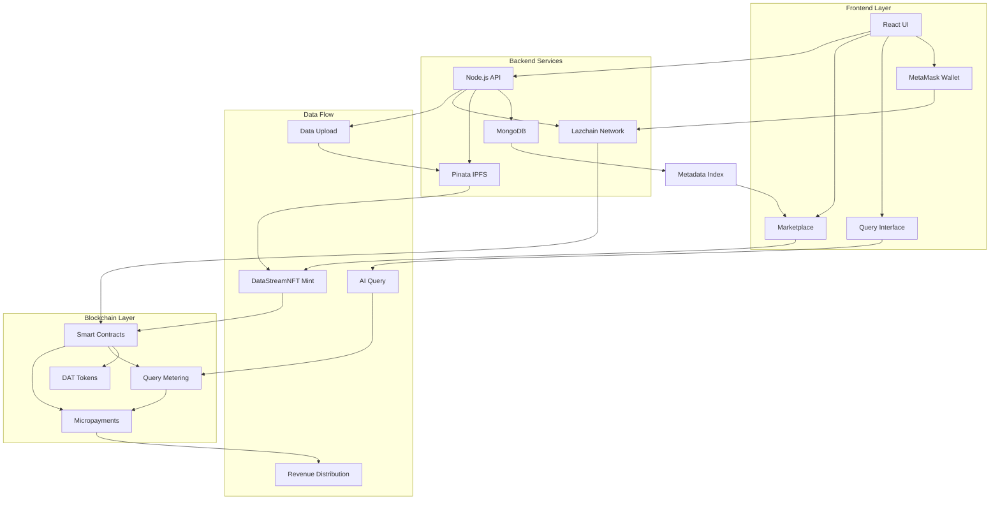
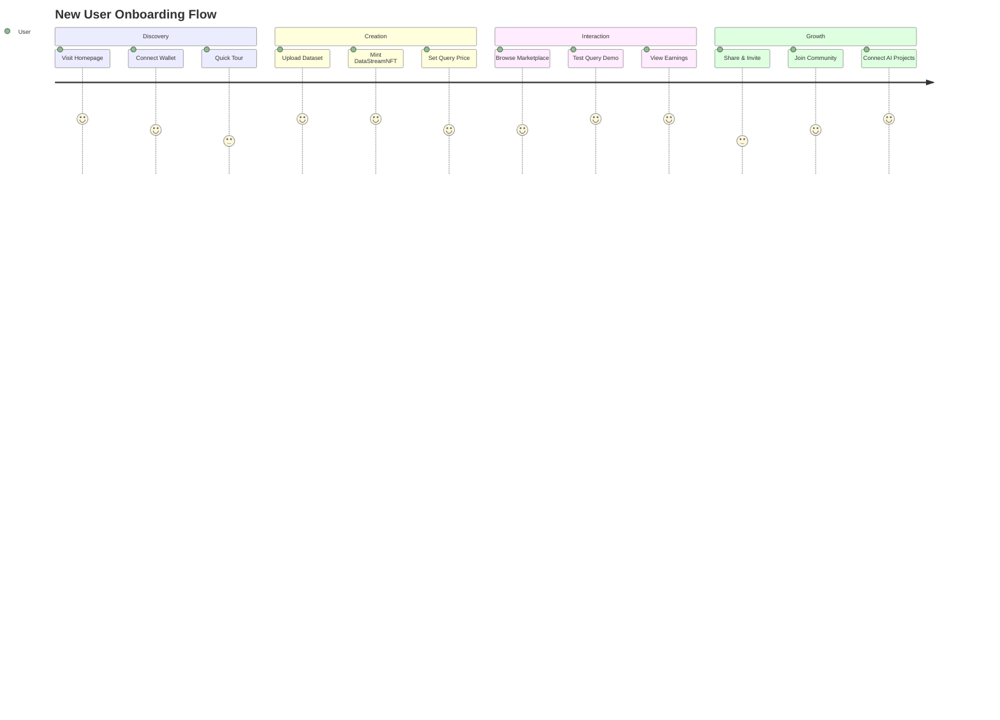

<div align="center">


# DataStreamNFT

> **Revolutionary Data Monetization Platform** - Transform your data into queryable NFTs that generate continuous revenue through AI model usage

[](https://github.com/yourusername/DataStreamNFT)
[](LICENSE)
[](https://lazchain.com)
[](https://pinata.cloud)
[](https://mongodb.com)

</div>

## 🎯 Problem Statement

<div align="center">

### The Data Economy Crisis

**Current Problem:** Data contributors powering AI models do not get paid for usage of their data beyond initial sales or downloads.

**Who's Affected:** Researchers, content creators, businesses supplying training data for AI and LLMs face revenue loss and lack transparency.

</div>

**Consequences:** 
- Contributors lose incentive to share high-quality data
- AI projects operate with limited, often poor data sources
- Unsustainable data economy

**Why Unsolved:** No on-chain query-metering or real-time micropayment solutions for data usage. Existing marketplaces do not integrate with AI query flows and lack composability with blockchain ownership models.

## 🏗️ Architecture Overview

<div align="center">



</div>

## 🚀 Solution Overview

**DataStreamNFT** enables minting data assets as NFTs with query-metered licensing that triggers micropayments on usage by AI models or applications.

### Core Innovation
- **On-chain data licensing** using DAT tokens tied to NFTs
- **Per-query micropayments** for AI model usage
- **Encrypted access control** with off-chain storage
- **Seamless Web3 integration** with Lazchain ecosystem

### Key Features
- 🎨 **Pinata IPFS** hosting for decentralized storage
- 🔐 **MetaMask** Web3 authentication
- 📊 **MongoDB** for metadata indexing
- ⛓️ **Lazchain** blockchain for smart contracts
- 💰 **Real-time micropayments** for data usage
- 🔄 **Secondary market** trading capabilities

## 🛠️ Technical Stack

| Component | Technology | Purpose |
|-----------|------------|---------|
| **Blockchain** | Lazchain Network | Scalable smart contracts & token ownership |
| **Storage** | Pinata Cloud | Decentralized IPFS file hosting |
| **Authentication** | MetaMask | Secure Web3 wallet integration |
| **Database** | MongoDB | Metadata indexing & user profiles |
| **Backend** | Node.js + Express | API layer & blockchain interactions |
| **Frontend** | React + Tailwind CSS | Responsive user interface |
| **SDK** | JavaScript SDK | Data NFT minting & query metering |
| **Development** | Hardhat + Ethers.js | Smart contract development |

## 🎮 User Journey

<div align="center">

### From Zero to Data NFT Owner in 10 Minutes



</div>

### User Stories

- **Creator**: Upload dataset → Mint DataStreamNFT → Set query price → Earn continuous revenue
- **AI Developer**: Query dataset → Smart contract verification → Micropayment transfer → Access granted
- **Contributor**: View earnings dashboard → Track query statistics → Monitor performance
- **Trader**: Secondary market trading → On-chain ownership transfer → Royalty distribution
- **Curator**: Reward high-quality data NFTs → Grant boosts → Community governance

## 🎯 Community Features

[](https://discord.gg/datastreamnft)
[](https://twitter.com/datastreamnft)
[](https://github.com/yourusername/DataStreamNFT/discussions)

- 🏆 **Gamification**: Leaderboards by earnings, query volume, and reputation
- 💬 **Discord Integration**: Real-time community support and collaboration
- ⭐ **Quality System**: User feedback, ratings, and quality reports
- 🛠️ **Open Source SDK**: Community-driven development and contributions
- 🎉 **Hackathons**: Regular events to onboard users and gather feedback

## 🚀 Getting Started

### Prerequisites

- Node.js 16+ and npm
- MetaMask wallet
- Git

### Installation

```bash
# Clone the repository
git clone https://github.com/yourusername/DataStreamNFT.git
cd DataStreamNFT

# Install dependencies
npm install

# Set up environment variables
cp .env.example .env
# Edit .env with your configuration

# Start development server
npm run dev
```

### Quick Start

1. **Connect Wallet**: Use MetaMask to connect to Lazchain network
2. **Upload Data**: Upload your dataset to Pinata IPFS
3. **Mint NFT**: Create your DataStreamNFT with custom pricing
4. **Start Earning**: AI queries will trigger automatic micropayments

## 📊 Roadmap

- [x] **Phase 1**: Core platform development
- [x] **Phase 2**: Smart contract deployment
- [ ] **Phase 3**: AI integration SDK
- [ ] **Phase 4**: Mobile application
- [ ] **Phase 5**: Cross-chain expansion

## 🤝 Contributing

We welcome contributions! Please see our [Contributing Guidelines](CONTRIBUTING.md) for details.

[](https://github.com/yourusername/DataStreamNFT/pulls)
[](https://github.com/yourusername/DataStreamNFT/issues)

## 📄 License

This project is licensed under the MIT License - see the [LICENSE](LICENSE) file for details.

## 🔗 Links

- **Website**: [datastreamnft.com](https://datastreamnft.com)
- **Documentation**: [docs.datastreamnft.com](https://docs.datastreamnft.com)
- **API Reference**: [api.datastreamnft.com](https://api.datastreamnft.com)
- **SDK Documentation**: [sdk.datastreamnft.com](https://sdk.datastreamnft.com)

---

<div align="center">

**Built with ❤️ for the future of data economy**

[](https://github.com/yourusername/DataStreamNFT)

</div>
