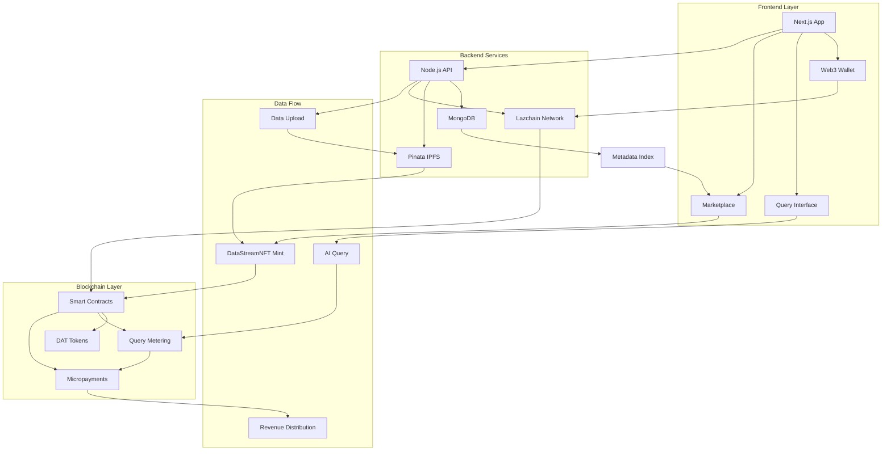

<div align="center">


# DataStreamNFT

> **Revolutionary Data Monetization Platform** - Transform your data into queryable NFTs that generate continuous revenue through AI model usage

[](https://github.com/yourusername/DataStreamNFT)
[](LICENSE)
[](https://lazchain.com)
[](https://pinata.cloud)
[](https://mongodb.com)

</div>

## 🎯 Problem Statement

<div align="center">

### The Data Economy Crisis

**Current Problem:** Data contributors powering AI models do not get paid for usage of their data beyond initial sales or downloads.

**Who's Affected:** Researchers, content creators, businesses supplying training data for AI and LLMs face revenue loss and lack transparency.

</div>

**Consequences:** 
- Contributors lose incentive to share high-quality data
- AI projects operate with limited, often poor data sources
- Unsustainable data economy

**Why Unsolved:** No on-chain query-metering or real-time micropayment solutions for data usage. Existing marketplaces do not integrate with AI query flows and lack composability with blockchain ownership models.

## 🏗️ Architecture Overview

<div align="center">


```mermaid
graph TB
    subgraph "Frontend Layer"
        A[Next.js App] --> B[Web3 Wallet]
        A --> C[Query Interface]
        A --> D[Marketplace]
    end
    
    subgraph "Backend Services"
        E[Node.js API] --> F[MongoDB]
        E --> G[Pinata IPFS]
        E --> H[Lazchain Network]
    end
    
    subgraph "Blockchain Layer"
        H --> I[Smart Contracts]
        I --> J[DAT Tokens]
        I --> K[Query Metering]
        I --> L[Micropayments]
    end
    
    subgraph "Data Flow"
        M[Data Upload] --> G
        G --> N[DataStreamNFT Mint]
        N --> I
        O[AI Query] --> K
        K --> L
        L --> P[Revenue Distribution]
    end
    
    A --> E
    B --> H
    C --> O
    D --> N
    E --> M
    F --> Q[Metadata Index]
    Q --> D
```

</div>

## 🚀 Solution Overview

**DataStreamNFT** enables minting data assets as NFTs with query-metered licensing that triggers micropayments on usage by AI models or applications.

### Core Innovation
- **On-chain data licensing** using DAT tokens tied to NFTs
- **Per-query micropayments** for AI model usage
- **Encrypted access control** with off-chain storage
- **Seamless Web3 integration** with Lazchain ecosystem

### Key Features
- 🎨 **Pinata IPFS** hosting for decentralized storage
- 🔐 **MetaMask** Web3 authentication
- 📊 **MongoDB** for metadata indexing
- ⛓️ **Lazchain** blockchain for smart contracts
- 💰 **Real-time micropayments** for data usage
- 🔄 **Secondary market** trading capabilities
- 🤖 **LazAI Integration** for encrypted data upload and AI inference
- 🪙 **Data Anchoring Tokens (DATs)** for privacy-preserving data monetization

## 🛠️ Technical Stack

| Component | Technology | Purpose |
|-----------|------------|---------|
| **Blockchain** | Lazchain Network | Scalable smart contracts & token ownership |
| **Storage** | Pinata Cloud | Decentralized IPFS file hosting |
| **Authentication** | MetaMask | Secure Web3 wallet integration |
| **Database** | MongoDB | Metadata indexing & user profiles |
| **Frontend** | Next.js 15 + React 19 | Modern, responsive user interface |
| **Backend** | Node.js + Express | RESTful API & business logic |
| **Testing** | Jest + Playwright | Comprehensive test coverage |
| **Monitoring** | Winston + Custom | Performance & error tracking |

## 🚀 Quick Start

### Prerequisites

- Node.js 18+ and npm 8+
- MongoDB 6+
- MetaMask browser extension
- Git

### Installation

1. **Clone the repository**
```bash
git clone https://github.com/yourusername/DataStreamNFT.git
cd DataStreamNFT
```

2. **Install dependencies**
```bash
npm install
cd fe && npm install && cd ..
```

3. **Set up environment variables**
```bash
cp .env.example .env
# Edit .env with your configuration
```

4. **Start MongoDB**
```bash
# On Windows
net start MongoDB

# On macOS/Linux
brew services start mongodb-community
```

5. **Start the development servers**
```bash
npm run dev
```

6. **Open your browser**
```
Frontend: http://localhost:3000
Backend API: http://localhost:3001
```

## 📖 Documentation

- **[User Guide](docs/USER_GUIDE.md)** - Complete user manual
- **[API Documentation](docs/API_DOCUMENTATION.md)** - REST API reference
- **[Developer Guide](docs/DEVELOPER_GUIDE.md)** - Development documentation
- **[Deployment Guide](docs/DEPLOYMENT_GUIDE.md)** - Production deployment
- **[LazAI Integration](docs/LAZAI_INTEGRATION.md)** - LazAI framework integration

## 🧪 Testing

### Run All Tests
```bash
npm test
```

### Run Specific Test Suites
```bash
# Contract tests
npm run test:contracts

# Backend API tests
npm run test:backend

# Frontend tests
npm run test:frontend

# End-to-end tests
npm run test:e2e

# Performance tests
npm run test:performance
```

### Test Coverage
```bash
npm run test:coverage
```

## 🚀 Deployment

### Development
```bash
npm run dev
```

### Production
```bash
npm run build
npm start
```

### Docker
```bash
docker build -t datastreamnft .
docker run -p 3000:3000 -p 3001:3001 datastreamnft
```

## 📊 Monitoring

### Health Check
```bash
curl http://localhost:3001/api/v1/monitoring/health
```

### Metrics
```bash
curl http://localhost:3001/api/v1/monitoring/metrics
```

### Performance Testing
```bash
npm run test:performance
```

## 🔧 Configuration

### Environment Variables

| Variable | Description | Default |
|----------|-------------|---------|
| `NODE_ENV` | Environment | `development` |
| `PORT` | Backend port | `3001` |
| `MONGODB_URI` | Database connection | `mongodb://localhost:27017/datastreamnft` |
| `LAZAI_RPC_URL` | Blockchain RPC | `https://testnet.lazai.network` |
| `PINATA_API_KEY` | IPFS API key | Required |
| `JWT_SECRET` | JWT signing secret | Required |

### Smart Contract Addresses

| Contract | Address |
|----------|---------|
| DataStreamNFT | `0x1868C3935B5A548C90d5660981FB866160382Da7` |
| DAT Token | `0x3A9F22DEddF83E5A49df9A9c946E4b0840ecd877` |

## 🤝 Contributing

We welcome contributions! Please see our [Contributing Guide](CONTRIBUTING.md) for details.

### Development Workflow

1. Fork the repository
2. Create a feature branch
3. Make your changes
4. Add tests
5. Submit a pull request

### Code Style

- ESLint for JavaScript/TypeScript
- Prettier for code formatting
- Conventional commits for commit messages

## 📈 Roadmap

### ✅ Completed
- [x] Core smart contracts
- [x] Backend API
- [x] Frontend application
- [x] LazAI integration
- [x] Testing suite
- [x] Performance monitoring
- [x] Documentation

### 🔄 In Progress
- [ ] Mobile application
- [ ] Advanced analytics
- [ ] API rate limiting
- [ ] Data validation tools

### 📋 Planned
- [ ] Community features
- [ ] Advanced AI models
- [ ] Cross-chain support
- [ ] Enterprise features

## 🐛 Troubleshooting

### Common Issues

**Wallet not connecting**
- Ensure MetaMask is installed and unlocked
- Check that you're on the LazAI Testnet
- Try refreshing the page

**Database connection issues**
- Verify MongoDB is running
- Check connection string in .env
- Ensure database permissions

**Build failures**
- Clear node_modules and reinstall
- Check Node.js version compatibility
- Verify all environment variables

### Getting Help

- **Documentation**: Check the guides above
- **Issues**: Report bugs on GitHub
- **Discussions**: Join our Discord server
- **Email**: support@datastreamnft.com

## 📄 License

This project is licensed under the MIT License - see the [LICENSE](LICENSE) file for details.

## 🙏 Acknowledgments

- [Lazchain](https://lazchain.com) for blockchain infrastructure
- [Pinata](https://pinata.cloud) for IPFS storage
- [OpenZeppelin](https://openzeppelin.com) for smart contract libraries
- [Next.js](https://nextjs.org) for the frontend framework
- [MongoDB](https://mongodb.com) for database services

## 📞 Contact

- **Website**: [datastreamnft.com](https://datastreamnft.com)
- **Email**: hello@datastreamnft.com
- **Twitter**: [@datastreamnft](https://twitter.com/datastreamnft)
- **Discord**: [Join our community](https://discord.gg/datastreamnft)
- **GitHub**: [github.com/yourusername/DataStreamNFT](https://github.com/yourusername/DataStreamNFT)

---

<div align="center">

**Built with ❤️ for the decentralized future**

[⭐ Star us on GitHub](https://github.com/yourusername/DataStreamNFT) • [🐛 Report Issues](https://github.com/yourusername/DataStreamNFT/issues) • [💬 Join Discussions](https://github.com/yourusername/DataStreamNFT/discussions)

</div>