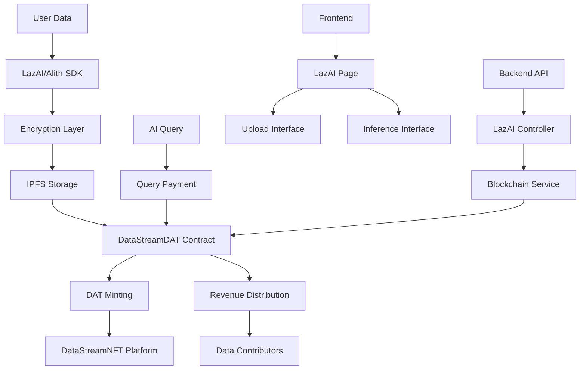

# LazAI Integration Documentation

This document provides comprehensive information about the LazAI/Alith integration with the DataStreamNFT platform, enabling encrypted data upload, Data Anchoring Token (DAT) minting, and AI inference capabilities.

## Table of Contents

1. [Overview](#overview)
2. [Architecture](#architecture)
3. [Setup Instructions](#setup-instructions)
4. [Python Integration](#python-integration)
5. [Smart Contract Integration](#smart-contract-integration)
6. [Frontend Integration](#frontend-integration)
7. [Backend API](#backend-api)
8. [Usage Examples](#usage-examples)
9. [Troubleshooting](#troubleshooting)
10. [API Reference](#api-reference)

## Overview

The LazAI integration brings advanced data privacy and AI inference capabilities to the DataStreamNFT platform:

- **Encrypted Data Upload**: Upload sensitive data to IPFS with end-to-end encryption
- **Data Anchoring Tokens (DATs)**: Mint NFTs that represent ownership of encrypted data
- **AI Inference**: Query encrypted data using AI models while maintaining privacy
- **Revenue Distribution**: Automatic distribution of query fees to data contributors
- **Dynamic Data Tracking**: Track data usage and value over time

## Architecture



## Setup Instructions

### Prerequisites

- Python 3.8 or higher
- Node.js 16 or higher
- LazAI wallet with private key
- Pinata IPFS JWT token
- Testnet tokens for gas fees

### 1. Python Environment Setup

```bash
# Create virtual environment
python3 -m venv venv

# Activate virtual environment
# On macOS/Linux:
source venv/bin/activate
# On Windows:
venv\Scripts\activate

# Install dependencies
pip install -r lazai-integration/requirements.txt
pip install alith -U
```

### 2. Environment Configuration

Create a `.env` file in the `lazai-integration/` directory:

```env
# LazAI/Alith Integration Environment Variables
PRIVATE_KEY=your_lazai_private_key_here
IPFS_JWT=your_pinata_jwt_token_here
LAZAI_RPC_URL=https://testnet.lazai.network
LAZAI_CHAIN_ID=133718
DAT_CONTRACT_ADDRESS=your_deployed_dat_contract_address
```

### 3. Deploy DataStreamDAT Contract

```bash
# Deploy the DAT contract
npx hardhat run scripts/deploy-dat.js --network lazchain
```

## Python Integration

### Basic Data Upload

```python
# lazai-integration/Dat.py
from contract_integration import DataStreamDATIntegration

# Initialize integration
integration = DataStreamDATIntegration()

# Upload data and mint DAT
result = integration.mint_dat(
    token_uri="https://ipfs.io/ipfs/QmExample123",
    query_price_wei=1000000000000000,  # 0.001 ETH
    file_id="lazai_file_12345",
    data_class="reference",
    data_value="high"
)

print(f"DAT minted with token ID: {result['token_id']}")
```

### Enhanced Data Upload

```python
# lazai-integration/enhanced_dat.py
python enhanced_dat.py
```

This script provides an interactive interface for:
- Data input and description
- Data classification and value assessment
- Query price setting
- Automatic metadata creation
- DAT minting on blockchain

### AI Inference

```python
# lazai-integration/inference.py
from contract_integration import DataStreamDATIntegration

# Initialize integration
integration = DataStreamDATIntegration()

# Pay for and execute query
result = integration.pay_for_query(
    token_id=1,
    query="What insights can you provide about this data?",
    payment_wei=1000000000000000  # 0.001 ETH
)

print(f"Query executed: {result['transaction_hash']}")
```

## Smart Contract Integration

### DataStreamDAT Contract

The `DataStreamDAT` contract extends the DataStreamNFT functionality with LazAI-specific features:

```solidity
contract DataStreamDAT is ERC721URIStorage, Ownable, ReentrancyGuard {
    struct DataAnchoringToken {
        address creator;
        uint256 queryPrice;
        uint256 totalQueries;
        uint256 totalEarned;
        string fileId;        // LazAI file ID
        string dataClass;     // Data classification
        string dataValue;     // Data value assessment
        uint256 createdAt;
        bool isActive;
    }
    
    function mintDataDAT(
        string memory tokenURI,
        uint256 queryPriceInWei,
        string memory fileId,
        string memory dataClass,
        string memory dataValue
    ) external returns (uint256);
    
    function payForQuery(uint256 tokenId, string memory query) external payable;
    function getDATByFileId(string memory fileId) external view returns (uint256, DataAnchoringToken memory);
    function updateDataClass(uint256 tokenId, string memory newDataClass) external;
    function updateDataValue(uint256 tokenId, string memory newDataValue) external;
}
```

### Key Features

- **File ID Tracking**: Maps LazAI file IDs to token IDs
- **Data Classification**: Supports model, reference, asset, and other data types
- **Value Assessment**: Low, medium, high value ratings
- **Dynamic Updates**: Owners can update data class, value, and file ID
- **Revenue Tracking**: Tracks total queries and earnings per DAT
- **Active Status**: Toggle DAT availability for queries

## Frontend Integration

### LazAI Page

The frontend includes a dedicated LazAI page (`/lazai`) with three main sections:

1. **Upload Data & Mint DAT**
   - Data input form
   - Classification and value selection
   - Query price setting
   - One-click upload and minting

2. **Run AI Inference**
   - File ID input
   - Query interface
   - Real-time inference execution

3. **View Results**
   - Upload results display
   - Inference results and metadata
   - Transaction links and statistics

### Navigation Integration

The LazAI page is accessible through the main navigation menu and includes:
- Wallet connection requirements
- Network validation (LazAI Testnet)
- Real-time status updates
- Error handling and user feedback

## Backend API

### LazAI Routes

The backend provides comprehensive API endpoints for LazAI integration:

```javascript
// Upload data and mint DAT
POST /api/lazai/upload
{
  "data": "Your sensitive data",
  "description": "Data description",
  "dataClass": "reference",
  "dataValue": "high",
  "queryPrice": "0.001",
  "creator": "0x..."
}

// Run AI inference
POST /api/lazai/inference
{
  "fileId": "lazai_file_12345",
  "query": "What insights can you provide?",
  "querier": "0x..."
}

// Get DAT information
GET /api/lazai/dat/:tokenId
GET /api/lazai/dat/file/:fileId

// Get DAT statistics
GET /api/lazai/stats/:tokenId

// Update DAT properties
PUT /api/lazai/dat/:tokenId/class
PUT /api/lazai/dat/:tokenId/value
PUT /api/lazai/dat/:tokenId/file
PUT /api/lazai/dat/:tokenId/toggle
```

### Controller Implementation

The `LazAIController` handles:
- Data upload orchestration
- Metadata creation and IPFS upload
- DAT minting on blockchain
- AI inference simulation
- Query payment processing
- DAT management operations

## Usage Examples

### Complete Workflow

1. **Setup Environment**
   ```bash
   cd lazai-integration
   python3 -m venv venv
   source venv/bin/activate
   pip install -r requirements.txt
   ```

2. **Configure Environment**
   ```bash
   cp env.example .env
   # Edit .env with your credentials
   ```

3. **Upload Data**
   ```bash
   python enhanced_dat.py
   # Follow interactive prompts
   ```

4. **Run Inference**
   ```bash
   python inference.py
   # Use the file ID from upload
   ```

5. **View on Frontend**
   - Navigate to `/lazai`
   - View uploaded data and results
   - Run additional queries

### Programmatic Usage

```python
from contract_integration import DataStreamDATIntegration

# Initialize
integration = DataStreamDATIntegration()

# Check balance
balance = integration.get_balance_eth()
print(f"Balance: {balance} ETH")

# Mint DAT
result = integration.mint_dat(
    token_uri="https://ipfs.io/ipfs/QmExample",
    query_price_wei=1000000000000000,
    file_id="lazai_123",
    data_class="reference",
    data_value="high"
)

# Query data
query_result = integration.pay_for_query(
    token_id=result['token_id'],
    query="Analyze this data",
    payment_wei=1000000000000000
)

# Get statistics
stats = integration.get_dat_stats(result['token_id'])
print(f"Total queries: {stats['total_queries']}")
```

## Troubleshooting

### Common Issues

**1. Environment Variables Not Set**
```bash
# Check if variables are set
echo $PRIVATE_KEY
echo $IPFS_JWT
```

**2. Virtual Environment Not Activated**
```bash
# Activate virtual environment
source venv/bin/activate
# Should see (venv) in prompt
```

**3. Insufficient Balance**
```bash
# Check balance
python -c "from contract_integration import DataStreamDATIntegration; i = DataStreamDATIntegration(); print(f'Balance: {i.get_balance_eth()} ETH')"
```

**4. Contract Not Deployed**
```bash
# Deploy DAT contract
npx hardhat run scripts/deploy-dat.js --network lazchain
```

**5. Network Connection Issues**
- Verify RPC URL is correct
- Check network connectivity
- Ensure testnet is operational

### Getting Help

- **LazAI Discord**: [Discord Link]
- **Documentation**: [LazAI Docs]
- **GitHub Issues**: [Repository Issues]
- **Telegram Support**: [@lazai_support]

## API Reference

### Python Integration

#### DataStreamDATIntegration Class

```python
class DataStreamDATIntegration:
    def __init__(self, rpc_url=None, contract_address=None, private_key=None)
    def mint_dat(self, token_uri, query_price_wei, file_id, data_class, data_value)
    def pay_for_query(self, token_id, query, payment_wei)
    def get_dat_stats(self, token_id)
    def get_balance(self)
    def get_balance_eth(self)
```

#### Methods

- `mint_dat()`: Mint a new Data Anchoring Token
- `pay_for_query()`: Pay for and execute a query
- `get_dat_stats()`: Get DAT statistics
- `get_balance()`: Get account balance in wei
- `get_balance_eth()`: Get account balance in ETH

### Backend API

#### Endpoints

| Method | Endpoint | Description |
|--------|----------|-------------|
| POST | `/api/lazai/upload` | Upload data and mint DAT |
| POST | `/api/lazai/inference` | Run AI inference |
| GET | `/api/lazai/dat/:tokenId` | Get DAT by token ID |
| GET | `/api/lazai/dat/file/:fileId` | Get DAT by file ID |
| GET | `/api/lazai/stats/:tokenId` | Get DAT statistics |
| POST | `/api/lazai/query` | Pay for query |
| GET | `/api/lazai/creator/:address` | Get creator's DATs |
| PUT | `/api/lazai/dat/:tokenId/class` | Update data class |
| PUT | `/api/lazai/dat/:tokenId/value` | Update data value |
| PUT | `/api/lazai/dat/:tokenId/file` | Update file ID |
| PUT | `/api/lazai/dat/:tokenId/toggle` | Toggle active status |

### Smart Contract

#### Events

```solidity
event DataDATMinted(uint256 indexed tokenId, address indexed creator, string tokenURI, uint256 queryPrice, string fileId, string dataClass, string dataValue);
event QueryPaid(uint256 indexed tokenId, address indexed querier, uint256 amount, string query);
event DataClassUpdated(uint256 indexed tokenId, string newClass);
event DataValueUpdated(uint256 indexed tokenId, string newValue);
event FileIdUpdated(uint256 indexed tokenId, string newFileId);
```

#### Functions

```solidity
function mintDataDAT(string memory tokenURI, uint256 queryPriceInWei, string memory fileId, string memory dataClass, string memory dataValue) external returns (uint256);
function payForQuery(uint256 tokenId, string memory query) external payable;
function getDATByFileId(string memory fileId) external view returns (uint256, DataAnchoringToken memory);
function getDATStats(uint256 tokenId) external view returns (uint256 totalQueries, uint256 totalEarned, bool isActive);
function updateDataClass(uint256 tokenId, string memory newDataClass) external;
function updateDataValue(uint256 tokenId, string memory newDataValue) external;
function updateFileId(uint256 tokenId, string memory newFileId) external;
function toggleActiveStatus(uint256 tokenId) external;
```

## Security Considerations

1. **Private Key Security**: Never commit private keys to version control
2. **Environment Variables**: Use secure environment variable management
3. **Data Encryption**: All data is encrypted before IPFS upload
4. **Access Control**: Only token owners can update DAT properties
5. **Payment Validation**: Query payments are validated on-chain
6. **Network Security**: Use HTTPS for all API communications

## Performance Optimization

1. **Gas Optimization**: Use efficient contract functions
2. **Batch Operations**: Group multiple operations when possible
3. **Caching**: Cache frequently accessed data
4. **Error Handling**: Implement comprehensive error handling
5. **Monitoring**: Monitor contract events and API performance

## Future Enhancements

1. **Real LazAI Integration**: Replace simulation with actual LazAI services
2. **Advanced Analytics**: Enhanced data usage analytics
3. **Multi-Chain Support**: Support for additional blockchains
4. **Mobile Support**: Mobile app integration
5. **API Rate Limiting**: Implement rate limiting for production
6. **Advanced Encryption**: Support for additional encryption methods
7. **Data Validation**: Automated data quality assessment
8. **Governance**: DAO-based platform governance

---

This integration provides a complete solution for privacy-preserving data monetization using LazAI's advanced infrastructure. The combination of encrypted data storage, blockchain-based ownership, and AI inference capabilities creates a powerful platform for data contributors and AI developers.
